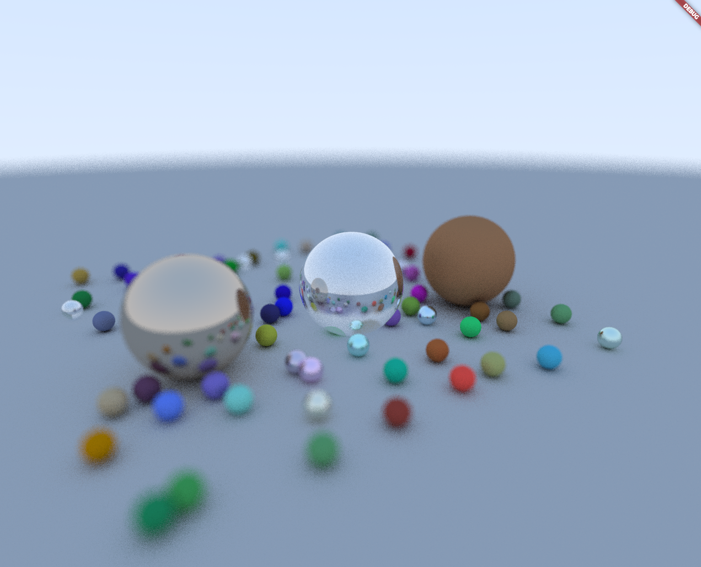

# ray_tracer

A Flutter application that implements a simple ray tracer based on the tutorial [Ray Tracing in One Weekend](https://raytracing.github.io/).

The code uses the vector_math package extensively.  There rendering is parallelized based on the number of cores
available.

## Tested on
 - Platform:
   - Ubuntu 20.04.4 LTS
   - Android 11
     - Platform android-31, build-tools 31.0.0
     - Java version OpenJDK Runtime Environment (build 11.0.11+0-b60-7590822)

 - Flutter:
   - Flutter 2.13.0-0.2.pre • channel beta • https://github.com/flutter/flutter.git
   - Framework • revision 8662e22bac (3 days ago) • 2022-04-20 08:21:52 -0700
   - Engine • revision 24a02fa5ee
   - Tools • Dart 2.17.0 (build 2.17.0-266.5.beta) • DevTools 2.12.2

